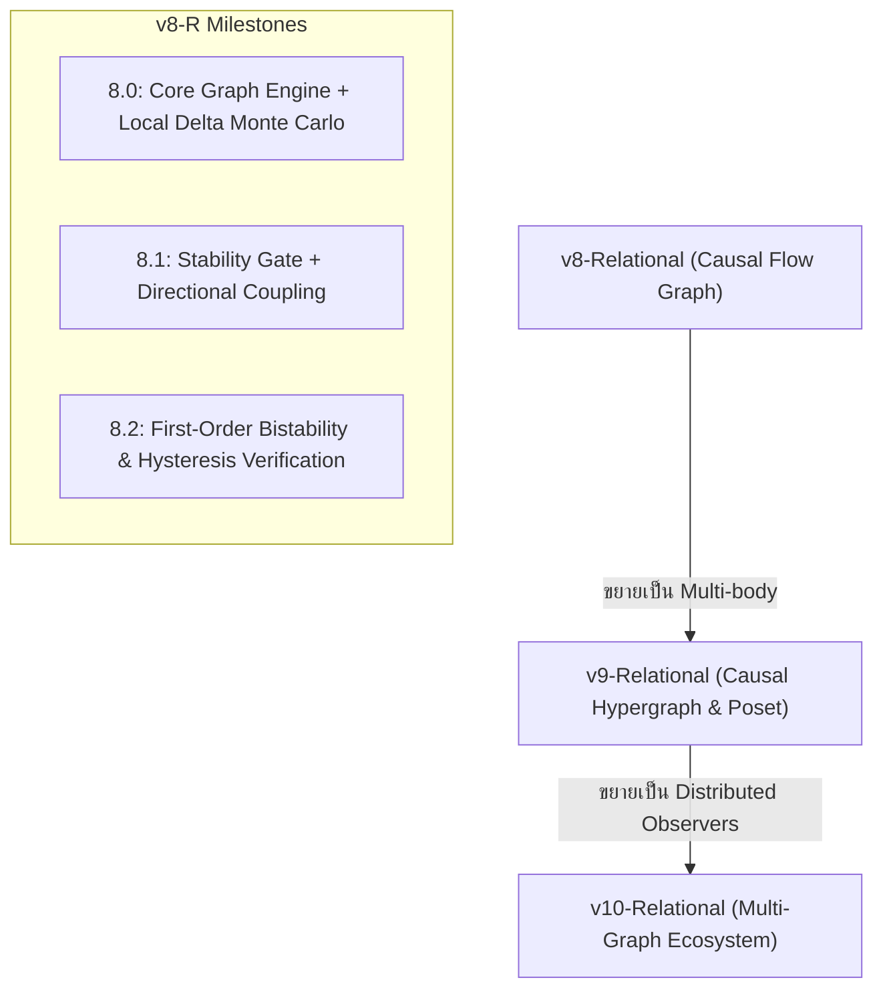

# 🌌 SGOED-Relational Master Architecture & Implementation Plan
**จาก Matrix Container สู่ Causal Graph Dynamics (v8-R → v9-R → v10-R)**

**ผู้เขียน:** Sutipong Chanpengpad & Antigravity AI  
**วันที่:** 30 สิงหาคม 2026  
**สถานะ:** เอกสารแผนแม่บทและการออกแบบสถาปัตยกรรม (Master Plan & Design Specification)  
**ตำแหน่งไฟล์:** `matrix/SGOED_RELATIONAL_PLAN.md`

---

## 🧭 1. วิสัยทัศน์และปรัชญาพื้นฐาน (Foundational Philosophy)

ในโมเดลเดิม (v1–v7) เราใช้ **Matrix Container** ขนาด $N \times N$ เป็นตัวแทนของ Space-Time Pre-geometric state ซึ่งมีข้อจำกัดสำคัญ 3 ประการ:
1. **Computational Bottleneck:** การคูณเมทริกซ์มี Complexity $O(N^3)$ ทำให้จำกัดอยู่ที่ $N \le 16$
2. **Implicit Background:** เมทริกซ์ขนาดคงที่แฝงโครงสร้างเชิงปริภูมิคงที่ไว้โดยปริยาย
3. **Rigid Dimensionality:** การกำหนด $D$ matrices บังคับมิติไว้ล่วงหน้า

**SGOED-Relational** ปฏิวัติรากฐานใหม่ทั้งหมดโดยอิง **Relational Ontology (ความสัมพันธ์เป็นปฐมบท)** ตามแนวคิดของ Leibniz, Rovelli (RQM/Thermal Time) และ Sorkin (Causal Sets):

$$\text{Event} \xrightarrow{\text{Relation}} \text{Directed Flow} \xrightarrow{\text{Observer Coupling}} \text{Topological Causal Order (Time)}$$

---

## ⚖️ 2. ตารางเปรียบเทียบเชิงสถาปัตยกรรม (Matrix vs Relational Graph)

| มิติเชิงกายภาพ/คณิตศาสตร์ | SGOED Matrix (v1–v7) | SGOED-Relational (v8-R) |
|---|---|---|
| **Fundamental Entity** | $D$ Hermitian Matrices $X^\mu \in \mathbb{C}^{N \times N}$ | Causal Weighted Graph $G = (V, E, W)$ |
| **State / Degree of Freedom** | Matrix elements $X_{ij}^\mu \in \mathbb{R}$ | Edge weights $w_{ij} \in [0, 1]$ หรือ $\mathbb{R}^+$ |
| **Observer Subsystem** | $d$ Hermitian Matrices $Y^a \in \mathbb{C}^{N \times N}$ | Subgraph $S \subset V$ ขนาด $d$ nodes |
| **Symmetry & Invariance** | $SO(D)$ rotational symmetry & $U(N)$ gauge | Permutation symmetry $\text{Aut}(G)$ ของ Nodes |
| **Emergent Time** | Single Matrix Eigenvalue Condensation ($R > 1.5$) | Global Directed Path / Topological Causal Order |
| **Action Energy** | $\text{Tr}([X_i, X_j]^2) + \text{Tr}(X^4)$ | Commutator Loop Energy + Degree Sparsity |
| **Stability Gate** | Penalty เมื่อ Extent $\text{Tr}(X^2)/N > 10.0$ | Node Capacity Gate: Out-degree / Capacity Cutoff |
| **Forward Coupling ($Y \to X$)** | $-g_{XY} \sum_\mu \hat{v}_\mu^2 \text{Tr}(X_\mu^4)$ | Directed Bias Energy $-g_{XY} \sum_{i \in S, j \in V \setminus S} \hat{v}_i \cdot w_{ij}^2$ |
| **Back-Reaction ($X \to Y$)** | $-g_{YX} \sum_a \hat{w}_a^2 \text{Tr}(Y_a^4)$ | Observer Clique/Loop Feedback $-g_{YX} \mathcal{C}(S)$ |
| **Computational Complexity** | $O(N^3)$ ต่อ Monte Carlo Sweep | $O(E) \approx O(N \log N)$ (สเกลได้ถึง $N = 10^3 - 10^5$) |

---

## 🔬 3. การออกแบบเชิงคณิตศาสตร์: v8-Relational (The Causal Flow Engine)

### 3.1 นิยามโครงสร้าง (Graph Specification)
- **Node Set:** $V = \{1, 2, \dots, N\}$ แทน Event/Pre-states
- **Directed Weight Matrix:** $W = [w_{ij}]_{N \times N}$ โดย $w_{ij} \ge 0$ แทนความแรงของความสัมพันธ์จาก Node $i \to j$
- **Observer Subgraph:** $S \subset V$ มีสมาชิก $d$ nodes (เช่น $d \in \{2, 3, 4, 5\}$)
- **Asymmetric Relations:** กำหนด $w_{ij} \neq w_{ji}$ เพื่อให้มีทิศทางของความเปลี่ยนแปลง (Arrow of Flow)

### 3.2 Relational Action Formulation
Action รวมของระบบ $S_{\text{total}} = S_G + S_{\text{gate}} + S_{\text{coupling}} + S_{\text{feedback}}$:

#### 1. Graph Base Action ($S_G$ — แทน IKKT Action)
สร้างความสมดุลระหว่างความประหยัดของความสัมพันธ์ (Sparsity) และความสอดคล้องของลูปความสัมพันธ์ (Relational Triangles):
$$S_G = \alpha \sum_{i \neq j} w_{ij}^2 + \beta \sum_{i, j, k} (w_{ij} w_{jk} - w_{ik})^2$$
*หมายเหตุ:* พจน์ที่สองทำหน้าที่เสมือน Commutator $[X_i, X_j]$ ใน Matrix Model เพื่อให้เกิดความสอดคล้องเชิงสามเหลี่ยม (Transitivity / Associativity)

#### 2. Stability Capacity Gate ($S_{\text{gate}}$ — แทน Matrix Extent Gate)
ป้องกันไม่ให้ Node ใดเกิดความจุเส้นเชื่อมเกินขนาด (ป้องกัน Runaway Density):
$$\text{deg}_{\text{out}}(i) = \sum_{j \neq i} w_{ij}, \quad \text{deg}_{\text{in}}(i) = \sum_{j \neq i} w_{ji}$$
$$S_{\text{gate}} = \lambda_{\text{gate}} \sum_{i \in V} \Theta\left(\text{deg}_{\text{out}}(i) - K_{\max}\right) \cdot \left(\text{deg}_{\text{out}}(i) - K_{\max}\right)^2$$

#### 3. Directional Observer Coupling ($S_{\text{coupling}}$ — $S \to G$)
ผู้สังเกตการณ์ $S$ สร้างทิศทางอ้างอิง $\hat{v} = (\hat{v}_1, \dots, \hat{v}_d)$ จากความไม่สมมาตรของ $S$:
$$\hat{v}_a = \frac{\text{deg}_{\text{out}}(a) - \text{deg}_{\text{in}}(a)}{\|\vec{v}\|_2 + \epsilon}, \quad a \in S$$
$$S_{\text{coupling}} = -g_{XY} \sum_{a \in S} \hat{v}_a \sum_{j \in V \setminus S} w_{aj}^2$$
*พจน์นี้จะเหนี่ยวนำให้ระบบหลัก $G$ เกิดกระแสการเชื่อมโยงทิศทางเดียว (Unidirectional Causal Flow) ไหลออกจาก Observer สู่ระบบ*

#### 4. Observer Back-Reaction ($S_{\text{feedback}}$ — $G \to S$)
กระแสที่ไหลกลับเข้ามาใน $S$ ทำให้ $S$ มีการควบแน่นของความสัมพันธ์ภายใน (Internal Clique Formation):
$$S_{\text{feedback}} = -g_{YX} \sum_{a, b \in S, a \neq b} w_{ab}^2 \cdot \left(\sum_{j \in V \setminus S} w_{ja}\right)$$

---

## 📈 4. ตัวชี้วัดการเกิดมิติเวลา (Emergence Observables)

เพื่อให้ผลลัพธ์สามารถตรวจสอบความถูกต้องได้อย่างเคร่งครัด (Rigorous Verification) เรานิยาม 4 Observables หลัก:

1. **Causal Asymmetry Ratio ($R_{\text{causal}}$ — เทียบเท่า Extent Ratio):**
   $$R_{\text{causal}} = \frac{\sum_{i < j} |w_{ij} - w_{ji}|}{\sum_{i < j} (w_{ij} + w_{ji}) + \epsilon} \in [0, 1]$$
   - $R_{\text{causal}} \to 0$: ไร้กาลเวลา (Symmetric Pre-temporal State)
   - $R_{\text{causal}} > 0.5$: เกิดลูกศรเวลา (Arrow of Time / Broken Time-Reversal)

2. **Acyclicity & DAGness ($D_{\text{DAG}}$):**
   วัดการปราศจาก Directed Cycles (การเกิด Total Causal Order):
   $$D_{\text{DAG}} = 1 - \frac{\text{Trace}(W^3)}{\sum_{i,j,k} w_{ij} w_{jk} w_{ki} + \epsilon}$$

3. **Longest Chain Length ($L_{\max}$ — Proper Time Interval):**
   ความยาวของเส้นทางที่ยาวที่สุดใน Causal Graph เปรียบเสมือน "เวลาจริง (Proper Time)" ที่ยืดขยายออกไป

4. **Observer-System Flow Alignment ($\mathcal{A}$):**
   วัดว่ากระแสหลักของ $G$ ชี้ไปในทิศทางเดียวกับที่ Observer $S$ ส่งแรงขับเคลื่อนหรือไม่ (ต้องได้ $100\%$ ในช่วง Healthy Emergence)

---

## 🗺️ 5. แผนการพัฒนาทีละขั้น (Step-by-Step Evolution Roadmap)

### 📦 Phase 1: v8-Relational — The Causal Flow Graph
- **เป้าหมาย:** พิสูจน์ว่า Causal Graph สร้าง Time Emergence และ First-Order Bistability ได้จริงโดยไม่ต้องใช้ Matrix
- **การทดสอบความถูกต้อง (Sanity Checks):**
  - ที่ $g_{XY} = 0$: $R_{\text{causal}} \approx 0$ (สมมาตร ไม่มีเวลา)
  - ที่ $g_{XY} \in [0.8, 1.2]$: $R_{\text{causal}} \to 0.7 - 0.9$ และ Alignment $= 100\%$
  - ตรวจสอบ Hysteresis Loop ของ $g_{YX}$ เพื่อยืนยัน First-Order Phase Transition ของ Observer Subgraph

### ⚡ Phase 2: v9-Relational — Causal Hypergraph & Posets
- **เป้าหมาย:** รองรับความสัมพันธ์แบบ $N$-ary (Hyperedges: 1 เหตุการณ์ผูกพันกับกลุ่มของเหตุการณ์)
- **โครงสร้าง:** Hypergraph $H = (V, \mathcal{E})$ โดย $\mathcal{E} \subset \mathcal{P}(V)$
- **การวัดผล:** Causal Set Discrete Volume และ Dimension Estimation (Myrheim-Meyer dimension)

### 🌐 Phase 3: v10-Relational — Multi-Graph Ecosystem
- **เป้าหมาย:** ระบบเครือข่ายที่มีผู้สังเกตหลายชุดแบบกระจายตัว (Multiple Distributed Observers)
- **พฤติกรรม Emergent:** การซิงโครไนซ์เวลาข้ามซับกราฟ (Relational Time Synchronization / Relativity of Simultaneity)

---

## 🛠️ 6. แผนการสร้างโค้ดชุดแรก (Action Plan (ใน `matrix/`)

เราจะเริ่มต้นสร้างโมดูลหลักในโฟลเดอร์ `matrix/` ดังนี้:

1. **`sgoed_graph_core.py`**: แกนประมวลผล Graph Engine พร้อม Fast Local Metropolis Delta Update ($O(1)$ ต่อ edge)
2. **`test_graph_action_delta.py`**: ทดสอบความแม่นยำของ Energy Delta เทียบกับ Full Action Recomputation ให้ได้ Machine Precision ($< 10^{-9}$)
3. **`audit_v8_emergence.py`**: รันการทดลอง Monte Carlo ($N=10, 20, 50, 100$, Seeds 42–46) เพื่อหาค่า $R_{\text{causal}}$, Alignment, และ Phase Diagram
4. **`audit_v8_hysteresis.py`**: ตรวจสอบ First-Order Feedback Transition และ Hysteresis Loop

---

## 🎯 7. บทสรุป

แผนพัฒนา **SGOED-Relational (v8-R → v9-R → v10-R)** นี้:
1. **ปลดล็อกขีดจำกัดขนาด $N$:** จากเดิม $N \le 16$ สู่ $N \ge 100 - 1000$ ด้วยอัลกอริทึม Graph ที่มีประสิทธิภาพสูง
2. **มีความหมายทางกายภาพลึกซึ้งขึ้น:** สอดคล้องกับปรัชญา Relational Physics อย่างแท้จริง โดยเวลาคือ Causal Flow ของเครือข่าย
3. **ตรวจสอบได้ด้วยเกณฑ์คณิตศาสตร์ชัดเจน:** มีตัวชี้วัด $R_{\text{causal}}$, $D_{\text{DAG}}$, และ Hysteresis Loop รองรับทุกขั้นตอน
